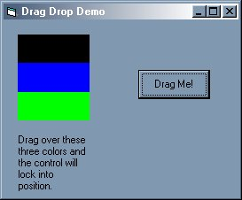



## A Simple Drag Drop Demo

### Description

This code gives a pretty good demo of how to drag and object, drop the object, and how to lock it into a position. Great for beginners. Simple and useful.
 
### More Info
 

             |
---                |---
**Submitted On**   |2000-11-22 14:42:56
**By**             |[spyrul](https://github.com/Planet-Source-Code/PSCIndex/blob/master/ByAuthor/spyrul.md)
**Level**          |Beginner
**User Rating**    |4.3 (13 globes from 3 users)
**Compatibility**  |VB 6\.0
**Category**       |[Miscellaneous](https://github.com/Planet-Source-Code/PSCIndex/blob/master/ByCategory/miscellaneous__1-1.md)
**World**          |[Visual Basic](https://github.com/Planet-Source-Code/PSCIndex/blob/master/ByWorld/visual-basic.md)
**Archive File**   |[CODE\_UPLOAD1193411222000\.zip](https://github.com/Planet-Source-Code/spyrul-a-simple-drag-drop-demo__1-13017/archive/master.zip)

